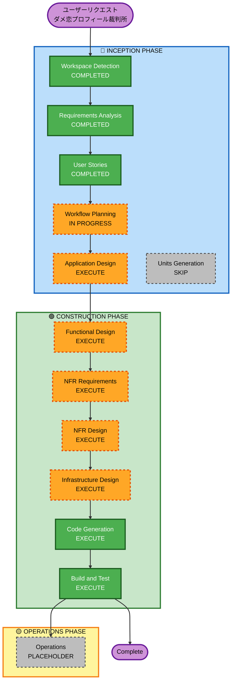

# 実行計画

## 詳細分析サマリー

### 変更インパクト評価
- **ユーザー向け変更**: あり — 4フェーズのWebアプリ全体
- **構造的変更**: あり — フロントエンド + バックエンド + AI統合の新規構築
- **データモデル変更**: あり — セッション管理 + 匿名データ永続保存
- **API変更**: あり — `/generate-questions` + `/analyze` の2エンドポイント新規作成
- **NFRインパクト**: あり — Bedrock レスポンス15秒以内、CloudFront キャッシュ

### リスク評価
- **リスクレベル**: Medium
- **主なリスク**: Claude Opus 4.7 の ap-northeast-1 可用性、Bedrock レスポンス時間、プロンプトエンジニアリングの品質
- **ロールバック複雑度**: Easy（Greenfield のため既存システムへの影響なし）
- **テスト複雑度**: Moderate（AIレスポンスの品質検証が必要）

---

## ワークフロー可視化



**テキスト代替（図が表示されない場合）:**
```
INCEPTION:  [WD✅] → [RA✅] → [US✅] → [WP🔄] → [AD▶] → [UG⏭]
CONSTRUCTION:                                      [FD▶] → [NFR-R▶] → [NFR-D▶] → [ID▶] → [CG▶] → [BT▶]
OPERATIONS:                                                                                              [OPS⏸]
```

---

## 実行フェーズ詳細

### 🔵 INCEPTION PHASE

- [x] Workspace Detection — COMPLETED
  - **根拠**: Greenfield プロジェクト確認済み
- [x] Reverse Engineering — SKIP（Greenfield のため不要）
- [x] Requirements Analysis — COMPLETED
  - **根拠**: 要件定義書生成・承認済み
- [x] User Stories — COMPLETED
  - **根拠**: 9ストーリー・3ペルソナ生成・承認済み
- [x] Workflow Planning — IN PROGRESS（本ドキュメント）
- [ ] Application Design — **EXECUTE**
  - **根拠**: 新規コンポーネント（React フロントエンド・Python Lambda・Bedrock統合）の設計が必要。コンポーネント境界・メソッド定義・サービス層の設計が実装品質に直結する
- [ ] Units Generation — **SKIP**
  - **根拠**: 単一ユニット（1つのWebアプリ）として実装可能。マイクロサービス分割は不要。フロントエンド・バックエンドは同一ユニット内のレイヤーとして扱う

### 🟢 CONSTRUCTION PHASE（単一ユニット: dame-koi-app）

- [ ] Functional Design — **EXECUTE**
  - **根拠**: Bedrock プロンプト設計・Phase 1/2 の対応ロジック・ダメさ翻訳アルゴリズムなど複雑なビジネスロジックの詳細設計が必要
- [ ] NFR Requirements — **EXECUTE**
  - **根拠**: Bedrock レスポンス時間（15秒）・CloudFront キャッシュ・DynamoDB 設計・PBT Partial 適用の技術スタック確定が必要
- [ ] NFR Design — **EXECUTE**
  - **根拠**: NFR Requirements で確定した要件をアーキテクチャパターンに落とし込む（Lambda タイムアウト設定・API Gateway 統合・ストリーミングレスポンス検討など）
- [ ] Infrastructure Design — **EXECUTE**
  - **根拠**: AWS リソース（API Gateway・Lambda・Bedrock・S3・CloudFront・DynamoDB）の具体的な構成・IAM ポリシー・デプロイ方法の設計が必要
- [ ] Code Generation — **EXECUTE**（ALWAYS）
  - **根拠**: 実装フェーズ
- [ ] Build and Test — **EXECUTE**（ALWAYS）
  - **根拠**: ビルド・テスト手順の生成

### 🟡 OPERATIONS PHASE
- [ ] Operations — PLACEHOLDER

---

## 推定タイムライン

| フェーズ | ステージ | 推定 |
|---------|---------|------|
| INCEPTION | Application Design | 1セッション |
| CONSTRUCTION | Functional Design | 1セッション |
| CONSTRUCTION | NFR Requirements | 1セッション |
| CONSTRUCTION | NFR Design | 1セッション |
| CONSTRUCTION | Infrastructure Design | 1セッション |
| CONSTRUCTION | Code Generation | 2〜3セッション |
| CONSTRUCTION | Build and Test | 1セッション |
| **合計** | | **8〜9セッション** |

---

## 成功基準

- **主目標**: AWS Summit Japan 2026 ハッカソンでデモ可能な状態
- **主要成果物**:
  - React SPA（4フェーズUI + 演出アニメーション）
  - Python Lambda（2エンドポイント）
  - Bedrock プロンプト（矛盾検知・否定文・改善案）
  - AWS インフラ（S3/CloudFront/API Gateway/Lambda/DynamoDB）
- **品質ゲート**:
  - Bedrock レスポンス15秒以内
  - 4フェーズフロー エンドツーエンド動作確認
  - 暗転・抹消線演出の動作確認
