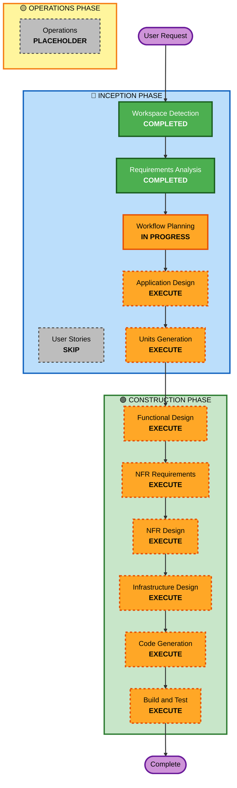

# Execution Plan - ダメ恋プロフィール裁判所

## Detailed Analysis Summary

### プロジェクトタイプ
- **タイプ**: Greenfield（新規開発）
- **複雑度**: 中程度
- **期間**: 2週間以内
- **チーム**: 2-3人以上

### Change Impact Assessment
- **ユーザー向け変更**: Yes - 新規Webアプリケーション
- **構造的変更**: Yes - フロントエンド、バックエンド、インフラの新規構築
- **データモデル変更**: No - データ永続化なし
- **API変更**: Yes - 新規REST API作成
- **NFR影響**: Yes - パフォーマンス（Bedrock 15秒以内）、コスト最適化

### Risk Assessment
- **リスクレベル**: 中程度
- **ロールバック複雑度**: 容易（サーバーレス構成）
- **テスト複雑度**: 中程度（主要機能の単体テスト）

### 主要な技術的課題
1. Bedrockプロンプト設計（矛盾検知→否定→改善案を1プロンプトで実現）
2. AI Safetyフィルター回避（学術用語での偽装）
3. レスポンス時間の最適化（15秒以内）
4. フロントエンド演出の実装（暗転、抹消線アニメーション）

---

## Workflow Visualization

---

## Phases to Execute

### 🔵 INCEPTION PHASE
- [x] Workspace Detection (COMPLETED)
- [x] Requirements Analysis (COMPLETED)
- [ ] User Stories - **SKIP**
  - **理由**: ハッカソンプロトタイプで、ペルソナとユーザージャーニーは既にintent.mdとrequirements.mdで定義済み。詳細なストーリー分解は不要
- [x] Workflow Planning (IN PROGRESS)
- [ ] Application Design - **EXECUTE**
  - **理由**: フロントエンド（4フェーズUI）、バックエンド（Lambda）、AI統合（Bedrock）の3つの主要コンポーネントの設計が必要
- [ ] Units Generation - **EXECUTE**
  - **理由**: フロントエンド、バックエンド、インフラの3つのユニットに分解して並行開発を可能にする

### 🟢 CONSTRUCTION PHASE
- [ ] Functional Design - **EXECUTE** (per-unit)
  - **理由**: 各ユニットのビジネスロジック（プロンプト設計、UI状態管理、API設計）の詳細設計が必要
- [ ] NFR Requirements - **EXECUTE** (per-unit)
  - **理由**: パフォーマンス（Bedrock 15秒以内）、コスト最適化、レスポンシブデザインの要件定義が必要
- [ ] NFR Design - **EXECUTE** (per-unit)
  - **理由**: NFR要件を満たすための具体的なパターン（キャッシング、トークン最適化、ローディング表示）の設計が必要
- [ ] Infrastructure Design - **EXECUTE** (per-unit)
  - **理由**: CDKによるインフラコード化、API Gateway、Lambda、Bedrockの統合設計が必要
- [ ] Code Generation - **EXECUTE** (ALWAYS, per-unit)
  - **理由**: 実装計画と実際のコード生成が必要
- [ ] Build and Test - **EXECUTE** (ALWAYS)
  - **理由**: ビルド、テスト、検証が必要

### 🟡 OPERATIONS PHASE
- [ ] Operations - **PLACEHOLDER**
  - **理由**: 将来的なデプロイメントとモニタリングのワークフロー

---

## Unit Decomposition Strategy

### 推奨ユニット構成（3ユニット）

**Unit 1: Frontend**
- 責任範囲: 4フェーズのUI、演出、状態管理
- 技術: Next.js、React、CSS Modules/Tailwind
- 依存関係: Backend APIを呼び出す

**Unit 2: Backend**
- 責任範囲: API Gateway、Lambda、Bedrockプロンプト実行
- 技術: Node.js/Python、Bedrock SDK
- 依存関係: Bedrockサービス

**Unit 3: Infrastructure**
- 責任範囲: CDKによるインフラコード、デプロイメント
- 技術: AWS CDK（TypeScript）
- 依存関係: Frontend、Backendの構成情報

### 並行開発の可能性
- Frontend と Backend は並行開発可能（API仕様を先に定義）
- Infrastructure は Frontend/Backend の実装後に統合

---

## Estimated Timeline

### 全体スケジュール（2週間）

**Week 1: INCEPTION + 設計**
- Day 1-2: Application Design + Units Generation
- Day 3-4: Functional Design（全ユニット）
- Day 5-7: NFR Requirements + NFR Design + Infrastructure Design

**Week 2: CONSTRUCTION**
- Day 8-11: Code Generation（全ユニット）
- Day 12-13: Build and Test
- Day 14: デモ準備、最終調整

### 各ステージの推定時間
- Application Design: 4時間
- Units Generation: 2時間
- Functional Design（per-unit）: 3時間 × 3 = 9時間
- NFR Requirements（per-unit）: 2時間 × 3 = 6時間
- NFR Design（per-unit）: 2時間 × 3 = 6時間
- Infrastructure Design（per-unit）: 3時間 × 3 = 9時間
- Code Generation（per-unit）: 8時間 × 3 = 24時間
- Build and Test: 8時間

**合計推定時間**: 約68時間（2週間で3人チームなら実現可能）

---

## Success Criteria

### Primary Goal
AWS Summit Japan 2026 ハッカソンで「人をダメにする」サービスとして評価されるデモを完成させる

### Key Deliverables
- [ ] 4フェーズすべてがエンドツーエンドで動作するWebアプリケーション
- [ ] Bedrock（Claude）による説得力のある論理的否定と改善案の生成
- [ ] 視覚的に印象的な演出（暗転、抹消線アニメーション）
- [ ] AWS CDKによるインフラコード
- [ ] 主要機能の単体テスト

### Quality Gates
- [ ] Bedrockレスポンス時間が15秒以内
- [ ] フロントエンド初期表示が3秒以内
- [ ] 主要機能の単体テストが全てパス
- [ ] デモシナリオが問題なく実行できる

### ハッカソン審査基準
- [ ] テーマ適合性: 「人をダメにする」メカニズムが明確
- [ ] 技術的実装: Bedrockの効果的な活用
- [ ] デモのインパクト: 法廷トーン + 演出の印象度
- [ ] 社会的意義: 自己研鑽社会へのカウンターとしての価値

---

## Risk Mitigation Strategy

### 技術的リスクへの対策

**リスク1: Bedrock（Claude Opus 4.7）の利用可能性**
- 対策: 事前にリージョン可用性を確認
- 代替案: Claude Sonnet 3.5を使用

**リスク2: プロンプトがAI Safetyフィルターに引っかかる**
- 対策: 学術用語・統計用語で攻撃性を客観的事実報告に偽装
- 代替案: トーンを調整、複数バージョンのプロンプトを用意

**リスク3: Bedrockのレスポンスが15秒を超える**
- 対策: プロンプトを最適化してトークン消費を削減
- 代替案: ローディング表示で体感時間を短縮、タイムアウト時間を延長

### スケジュールリスクへの対策

**リスク4: 2週間で実装が完了しない**
- 対策: MVP（Minimum Viable Product）を明確化
- 優先順位: 演出は最後に実装、まず動作する基本機能を完成

**リスク5: チームメンバーの稼働が確保できない**
- 対策: 役割分担を明確化、並行作業可能な設計
- 代替案: ユニット単位で優先順位を付け、最低限Frontend + Backendを完成

---

## Next Steps

1. **Application Design**: フロントエンド、バックエンド、インフラの主要コンポーネントを設計
2. **Units Generation**: 3つのユニット（Frontend、Backend、Infrastructure）に分解
3. **Per-Unit Design**: 各ユニットの詳細設計（Functional、NFR、Infrastructure）
4. **Code Generation**: 各ユニットのコード生成
5. **Build and Test**: ビルド、テスト、デモ準備
